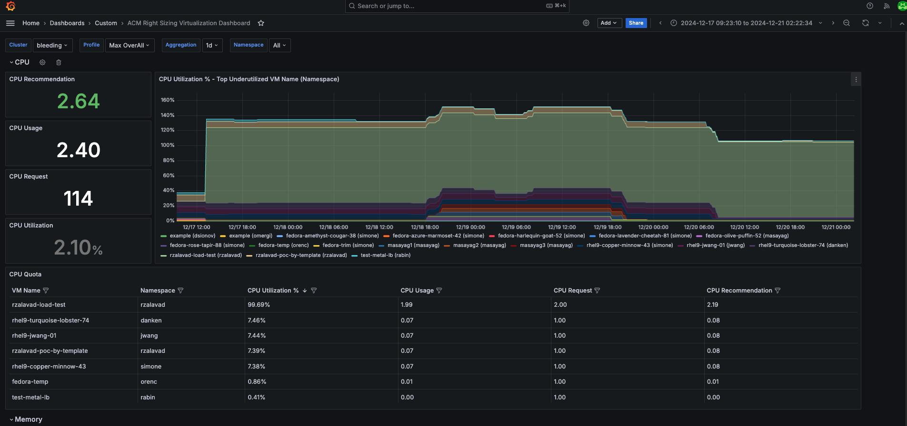

# ACM Right Sizing at Virtualization level

Below is the screenshot of ACM Right Sizing grafana dashboard at Virtualization level. 

* In Virtualization, we provide data at pod level (VM Name) compared to ACM Right Sizing at namespace level.
* Overall we have 3 levels of data: cluster, namespace and pod level.

# Metrics Used
* CPU Usage: `kubevirt_vmi_cpu_usage_seconds_total`
* Memory Usage: `kubevirt_vmi_memory_available_bytes` - `kubevirt_vmi_memory_usable_bytes`
* CPU Request: `kubevirt_vm_resource_requests{resource="cpu"}`
* Memory Request: `kubevirt_vm_resource_requests{resource="memory"}`

# Installation Steps 

You can checkout [this](installation-steps.md) page for detailed steps on installing Right Sizing Virtualization components.

# How to Use Grafana?

We have given basic instruction on how you can use grafana for Right Sizing Virtualization [here](how-to-use-grafana.md), you can check out for more details.   
