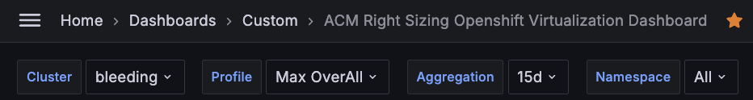

This Document described how you can interact with grafana dashboards. 

1. You can go to Grafana on Hub Cluster and search for the `ACM Right Sizing Openshift Virtualization Dashboard` dashboard. Click on it, and you are ready to use ACM Right Sizing for Virtualization solution.

2. Select Specific filter criteria based on need

    

   * Cluster: Dropdown contains all the managed cluster names.
   * Profile: For time being only `Max Overall` profile will be available, in future we will incorporate other mechanism to do Right Sizing along with existing `Max Overall`
   * Aggregation: It contains number of days we want to get data from. Ex: for `Max Overall` if you select `30d` that means we are looking for 30 days peak/max value for the CPU/Memory and looking for recommendation based on `30d` data points. 

3. Top 4 Panels show *overall total* values over selected last days of aggregation for CPU/Mem Overestimation, CPU/Mem Underestimation across all namespaces.

    

4. CPU Overestimation and CPU Underestimation table shows max values over last selected aggregation days of namespaces and/or pods available for clusters for CPU Utilization Percentage, CPU Utilization, CPU Request, CPU Recommendation, CPU Overestimation (Requires less resources than requested), CPU Underestimation (Requires more resources than requested).

    

5. Memory Overestimation and Memory Underestimation table shows max values over last selected aggregation days of namespaces and/or pods available for clusters for Memory Utilization Percentage, Memory Utilization, Memory Request, Memory Recommendation, Memory Overestimation (Requires less resources than requested), Memory Underestimation (Requires more resources than requested).

    

    **Note** : Minimum CPU request is 1 CPU and Minimum Memory request is 1GB.

    * If CPU request is 1 CPU core and utilization is less than 1 core, then we can not say it is Overestimated as minimum CPU request is 1 CPU.

    * If Memory request is 1 GB and utilization is less than 1 GB, then we can not say it is Overestimated as minimum Memory request is 1 GB.

    * CPU/Memory Recommendation is less than CPU/Memory Request then the resources are Overestimated and requires less resources than requested.
    
    * CPU/Memory Recommendation is greater than CPU/Memory Request then the resources are Underestimated and requires more resources than requested.

6. Click on the Column Header to sort values of particular columns.

7. Click on the Namespace Filter Icon in the Column Header to filter values based on user need.

    

8. Click on the VM Name Filter Icon in the Column Header to filter the values further.

    

9. Click on the hyperlink of VM Name value or Namespace value in the table to see deatiled level view of resource utilization for respected VM.

    

10. Detailed view for the VM level show left side 4 pannels and Graph for the utilization.
    
    

11. VM Level Detailed view for the CPU: Left 4 Panels show VM level maximum values over selected last days of aggregation for CPU Overestimation/Underestimation, CPU Utilization, CPU Request and CPU Utilization% and graph shows CPU Utilization% values for the selected VM.

    

12. VM Level Detailed view for the Memory: Left 4 Panels show VM level maximum values over selected last days of aggregation for Memory Overestimation/Underestimation, Memory Utilization, Memory Request and Memory Utilization% and graph shows Memory Utilization% values for the selected VM.

    

13. Click on `Back to Main Dashboard` button on top right to go back to the Main Dashboard.

    

